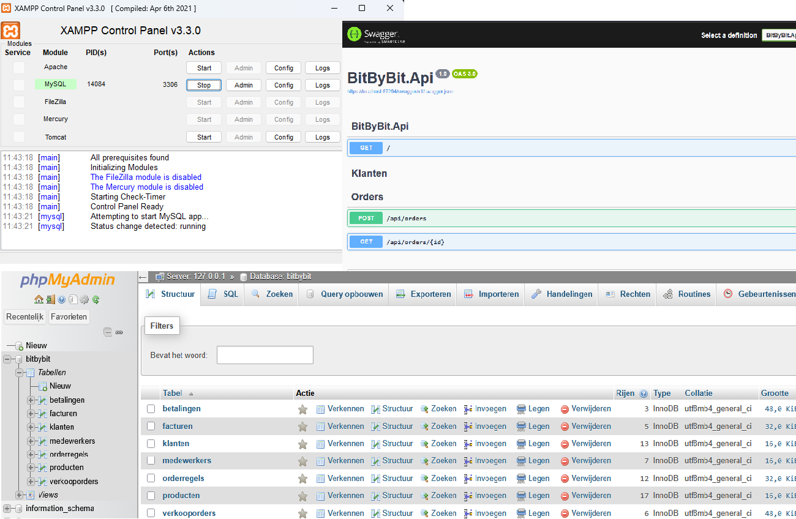

# 🗄️ BitByBit – SQL & .NET Core Course (v9)



📄 Reader: SQL (Jaar 1)

---

# Welkom bij de BitByBit leerlijn

In deze module leer je stap voor stap werken met **SQL en databases**.  
Je leert hoe je data kunt **ophalen, filteren, sorteren, combineren en analyseren**.

Daarna koppel je de database aan **.NET Core** en voer je dezelfde queries uit in **C# met Entity Framework (ORM)**.

---

## Wat betekent dit concreet?

- Je leert SQL queries schrijven
- Je leert werken met een echte database
- Je leert tabellen en relaties begrijpen
- Je leert data analyseren
- Je leert dezelfde logica toepassen in SQL en in C#

---

## Waarom is dit nuttig?

Databases vormen de basis van veel informatiesystemen.  
Als je begrijpt hoe data wordt opgeslagen, gekoppeld en opgevraagd, begrijp je ook beter hoe administratiesystemen, webapplicaties en backend software werken.

---

## Wat kun je hier later mee?

- Voorbereiding op stages en projecten
- Sterke basis voor backend ontwikkeling
- Inzicht in datamodellen en informatiestromen
- Betere voorbereiding op ORM en API-ontwikkeling

---

## 🧭 Navigatie

🔹 [Week 1 – Intro Database & SELECT](#week-1--intro-database--select)  
🔹 [Week 2 – WHERE & Filtering](#week-2--where--filtering)  
🔹 [Week 3 – ORDER BY & DISTINCT](#week-3--order-by--distinct)  
🔹 [Week 4 – Joins & Relaties](#week-4--joins--relaties)  
🔹 [Week 5 – GROUP BY & Aggregaties](#week-5--group-by--aggregaties)  
🔹 [Week 6 – Database Begrijpen](#week-6--database-begrijpen)  
🔹 [Week 7 – EF Core Scaffolding](#week-7--ef-core-scaffolding)  
🔹 [Week 8 – SQL vs LINQ & Eindopdracht](#week-8--sql-vs-linq--eindopdracht)  

---

## Week 1 – Intro Database & SELECT

📺 **LessonUp**  
*(toevoegen)*

🎯 **Focus**
- Wat is een database
- Tabellen en kolommen herkennen
- `select` en `from`
- Data ophalen uit één tabel

🧪 **Praktijk**
- Eerste queries uitvoeren in phpMyAdmin
- Resultaten lezen en controleren
- Verschil zien tussen alle kolommen en een selectie van kolommen

📄 **Aanvullende Lesnotities / Opdrachten**
> Hieronder vind je het uitgebreide weekbestand dat extra uitleg en opdrachten bevat.

### Wat ga je leren
In deze week leer je hoe je gegevens uit een tabel ophaalt.  
Je gebruikt hiervoor het SQL-commando `select`.  
Met `select` bepaal je welke kolommen je wilt zien.  
Met `from` geef je aan uit welke tabel de data moet komen.

### Theorie
Een eenvoudige query ziet er zo uit:

```sql
select *
from klanten;
```

Met `*` vraag je alle kolommen op uit de tabel.

Je kunt ook alleen bepaalde kolommen tonen:

```sql
select naam, plaats
from klanten;
```

Dan zie je alleen de kolommen `naam` en `plaats`.

### Opdrachten

🟢 **Beginner**

1. Toon alle gegevens van alle klanten.

```sql
select *
from klanten;
```

2. Toon alleen de naam en plaats van alle klanten.

```sql
select naam, plaats
from klanten;
```

3. Toon alle gegevens van alle producten.

```sql
select *
from producten;
```

4. Toon de omschrijving en prijs van alle producten.

```sql
select omschrijving, prijs
from producten;
```

🟡 **Intermediate**

5. Toon de naam, plaats en het telefoonnummer van alle klanten.

```sql
select naam, plaats, telnr
from klanten;
```

6. Toon de klantnaam en woonplaats met aliassen.

```sql
select naam as klantnaam, plaats as woonplaats
from klanten;
```

7. Toon alle producten met een berekende prijs inclusief 21% btw.

```sql
select omschrijving, prijs, prijs * 1.21 as prijs_incl_btw
from producten;
```

🟠 **Advanced**

8. Toon een samengestelde weergave van klanten in één kolom.

```sql
select concat(naam, ' - ', plaats) as klant_weergave
from klanten;
```

9. Geef per klant aan of deze lokaal of extern is op basis van plaats.

```sql
select naam,
       case
           when plaats = 'Haarlem' then 'Lokaal'
           else 'Extern'
       end as type_klant
from klanten;
```

10. Toon unieke combinaties van plaats en postcode.

```sql
select distinct plaats, postcode
from klanten;
```

## Advies voor deze week
- Controleer altijd eerst uit welke tabel je gegevens wilt halen.
- Begin met `select *` als je nog niet precies weet welke kolommen je nodig hebt.
- Schrijf kolomnamen nauwkeurig over om fouten te voorkomen.

🔝 [Terug naar navigatie](#-navigatie)

---

## Week 2 – WHERE & Filtering

📺 **LessonUp**  
*(toevoegen)*

🎯 **Focus**
- `where`
- Vergelijkingen met `=`, `>`, `<`, `<>`, `>=`, `<=`
- `like`
- `between`

🧪 **Praktijk**
- Data filteren op basis van voorwaarden
- Resultaten verkleinen zodat alleen relevante data overblijft
- Verschil zien tussen numerieke filters en tekstfilters

📄 **Aanvullende Lesnotities / Opdrachten**
> Hieronder vind je het uitgebreide weekbestand dat extra uitleg en opdrachten bevat.

### Wat ga je leren
In deze week leer je hoe je niet alles toont, maar alleen de rijen die voldoen aan een voorwaarde.  
Daarvoor gebruik je `where`.  
Met `where` kun je bijvoorbeeld klanten uit één plaats tonen of producten boven een bepaalde prijs.

### Theorie
Een filter op tekst ziet er zo uit:

```sql
select *
from klanten
where plaats = 'Haarlem';
```

Een filter op een getal ziet er zo uit:

```sql
select *
from producten
where prijs > 500;
```

Je kunt ook zoeken op een bereik:

```sql
select *
from producten
where prijs between 100 and 500;
```

### Opdrachten

🟢 **Beginner**

1. Toon alle klanten uit Haarlem.

```sql
select *
from klanten
where plaats = 'Haarlem';
```

2. Toon alle producten met een prijs groter dan 500.

```sql
select *
from producten
where prijs > 500;
```

3. Toon alle producten met een voorraad kleiner dan 10.

```sql
select *
from producten
where voorraad < 10;
```

4. Toon alle klanten die niet uit Haarlem komen.

```sql
select *
from klanten
where plaats <> 'Haarlem';
```

🟡 **Intermediate**

5. Toon alle producten met een prijs groter dan 100 én een voorraad groter dan 10.

```sql
select *
from producten
where prijs > 100
  and voorraad > 10;
```

6. Toon alle klanten uit Haarlem of Amsterdam.

```sql
select *
from klanten
where plaats = 'Haarlem'
   or plaats = 'Amsterdam';
```

7. Toon alle klanten waarvan de naam ergens de letter `a` bevat.

```sql
select *
from klanten
where naam like '%a%';
```

🟠 **Advanced**

8. Toon alle producten die duurder zijn dan de gemiddelde prijs van alle producten.

```sql
select *
from producten
where prijs > (
    select avg(prijs)
    from producten
);
```

9. Toon alle klanten die minstens één verkooporder hebben geplaatst.

```sql
select *
from klanten
where klantnr in (
    select klantnr
    from verkooporders
);
```

10. Toon alle klanten die nog geen verkooporder hebben geplaatst.

```sql
select *
from klanten
where not exists (
    select 1
    from verkooporders v
    where v.klantnr = klanten.klantnr
);
```

## Advies voor deze week
- Zet tekst altijd tussen enkele quotes.
- Controleer of je filter op een getal of op tekst werkt.
- Lees je query hardop terug: “toon alle … waar …”.

🔝 [Terug naar navigatie](#-navigatie)

---

## Week 3 – ORDER BY & DISTINCT

📺 **LessonUp**  
*(toevoegen)*

🎯 **Focus**
- Sorteren met `order by`
- Oplopend en aflopend sorteren
- Dubbele waarden verwijderen met `distinct`

🧪 **Praktijk**
- Resultaten overzichtelijk ordenen
- Unieke waarden herkennen
- Verschil zien tussen volledige lijsten en unieke waarden

📄 **Aanvullende Lesnotities / Opdrachten**
> Hieronder vind je het uitgebreide weekbestand dat extra uitleg en opdrachten bevat.

### Wat ga je leren
In deze week leer je hoe je resultaten sorteert.  
Je gebruikt hiervoor `order by`.  
Daarnaast leer je hoe je dubbele waarden uit een resultaat haalt met `distinct`.

### Theorie
Sorteren op naam:

```sql
select *
from klanten
order by naam;
```

Aflopend sorteren op prijs:

```sql
select *
from producten
order by prijs desc;
```

Unieke plaatsen tonen:

```sql
select distinct plaats
from klanten;
```

### Opdrachten

🟢 **Beginner**

1. Sorteer alle klanten op naam.

```sql
select *
from klanten
order by naam;
```

2. Sorteer alle producten op prijs van hoog naar laag.

```sql
select *
from producten
order by prijs desc;
```

3. Toon alle unieke plaatsen van klanten.

```sql
select distinct plaats
from klanten;
```

4. Sorteer alle producten op voorraad.

```sql
select *
from producten
order by voorraad;
```

🟡 **Intermediate**

5. Sorteer klanten eerst op plaats en daarna op naam.

```sql
select *
from klanten
order by plaats, naam;
```

6. Toon producten met een berekende prijs inclusief btw en sorteer daarop aflopend.

```sql
select omschrijving, prijs, prijs * 1.21 as prijs_incl
from producten
order by prijs_incl desc;
```

7. Toon unieke plaatsen en sorteer die alfabetisch.

```sql
select distinct plaats
from klanten
order by plaats;
```

🟠 **Advanced**

8. Toon de vijf duurste producten.

```sql
select *
from producten
order by prijs desc
limit 5;
```

9. Sorteer klantnamen op lengte van de naam.

```sql
select naam
from klanten
order by length(naam);
```

10. Sorteer producten op de waarde `prijs * voorraad` van hoog naar laag.

```sql
select *
from producten
order by (prijs * voorraad) desc;
```

## Advies voor deze week
- Gebruik `asc` als je expliciet oplopend wilt aangeven.
- Gebruik `desc` als je aflopend wilt sorteren.
- Vraag jezelf bij `distinct` af: wil ik unieke rijen of unieke waarden in één kolom?

🔝 [Terug naar navigatie](#-navigatie)

---

## Week 4 – Joins & Relaties

📺 **LessonUp**  
*(toevoegen)*

🎯 **Focus**
- Tabellen koppelen met `join`
- `inner join`
- `left join`
- Relaties volgen tussen tabellen

🧪 **Praktijk**
- Data uit meerdere tabellen combineren
- Klanten koppelen aan orders
- Orders koppelen aan facturen
- Facturen koppelen aan betalingen

📄 **Aanvullende Lesnotities / Opdrachten**
> Hieronder vind je het uitgebreide weekbestand dat extra uitleg en opdrachten bevat.

### Wat ga je leren
In deze week leer je hoe je gegevens uit meerdere tabellen combineert.  
Dat doe je met een `join`.  
Een join gebruikt de relatie tussen tabellen, bijvoorbeeld een klantnummer of ordernummer.

### Theorie
Een `inner join` tussen klanten en verkooporders:

```sql
select k.naam, v.ordernr
from klanten k
join verkooporders v on v.klantnr = k.klantnr;
```

Een `left join` laat alle rijen van de linkertabel zien, ook als er geen match is in de rechtertabel.

```sql
select f.factuurnr, b.bedrag
from facturen f
left join betalingen b on b.factuurnr = f.factuurnr;
```

### Opdrachten

🟢 **Beginner**

1. Toon de klantnaam met het ordernummer van elke verkooporder.

```sql
select k.naam, v.ordernr
from klanten k
join verkooporders v on v.klantnr = k.klantnr;
```

2. Toon het ordernummer met het factuurnummer van elke factuur.

```sql
select v.ordernr, f.factuurnr
from verkooporders v
join facturen f on f.ordernr = v.ordernr;
```

3. Toon het factuurnummer met het betaalde bedrag.

```sql
select f.factuurnr, b.bedrag
from facturen f
left join betalingen b on b.factuurnr = f.factuurnr;
```

4. Toon het ordernummer met de naam van de klant.

```sql
select v.ordernr, k.naam
from verkooporders v
join klanten k on k.klantnr = v.klantnr;
```

🟡 **Intermediate**

5. Toon de naam van de klant met het factuurnummer.

```sql
select k.naam, f.factuurnr
from klanten k
join verkooporders v on v.klantnr = k.klantnr
join facturen f on f.ordernr = v.ordernr;
```

6. Toon per klant het totale factuurbedrag.

```sql
select k.naam, sum(f.bedrag) as totaal_factuurbedrag
from klanten k
join verkooporders v on v.klantnr = k.klantnr
join facturen f on f.ordernr = v.ordernr
group by k.naam;
```

7. Toon per klant het aantal verkooporders, ook als dat 0 is.

```sql
select k.naam, count(v.ordernr) as aantal_orders
from klanten k
left join verkooporders v on v.klantnr = k.klantnr
group by k.naam;
```

🟠 **Advanced**

8. Toon alle klanten die nog geen verkooporder hebben.

```sql
select k.naam
from klanten k
left join verkooporders v on v.klantnr = k.klantnr
where v.ordernr is null;
```

9. Toon alle facturen waarvoor nog geen betaling bestaat.

```sql
select f.factuurnr
from facturen f
left join betalingen b on b.factuurnr = f.factuurnr
where b.betalingnr is null;
```

10. Toon alle klanten waarvan het totaal betaalde bedrag groter is dan 1000.

```sql
select k.naam, sum(b.bedrag) as totaal_betaald
from klanten k
join betalingen b on b.klantnr = k.klantnr
group by k.naam
having sum(b.bedrag) > 1000;
```

## Advies voor deze week
- Kijk altijd eerst welke kolommen de tabellen aan elkaar koppelen.
- Gebruik aliassen zoals `k`, `v`, `f` en `b` om je query leesbaar te houden.
- Teken desnoods eerst de relatie op papier voordat je een join schrijft.

🔝 [Terug naar navigatie](#-navigatie)

---

## Week 5 – GROUP BY & Aggregaties

📺 **LessonUp**  
*(toevoegen)*

🎯 **Focus**
- `count`, `sum`, `avg`, `max`
- `group by`
- `having`

🧪 **Praktijk**
- Samenvattingen maken van data
- Tellingen en totalen berekenen
- Verschil zien tussen `where` en `having`

📄 **Aanvullende Lesnotities / Opdrachten**
> Hieronder vind je het uitgebreide weekbestand dat extra uitleg en opdrachten bevat.

### Wat ga je leren
In deze week leer je hoe je gegevens samenvat.  
Je gebruikt functies zoals `count` en `sum`.  
Met `group by` groepeer je data.  
Met `having` filter je groepen nadat de samenvatting is gemaakt.

### Theorie
Aantal orders per klant:

```sql
select klantnr, count(*) as aantal_orders
from verkooporders
group by klantnr;
```

Totaal orderbedrag per klant:

```sql
select klantnr, sum(orderbedrag) as totaal
from verkooporders
group by klantnr;
```

### Opdrachten

🟢 **Beginner**

1. Tel het aantal orders per klant.

```sql
select klantnr, count(*) as aantal_orders
from verkooporders
group by klantnr;
```

2. Bereken het totale orderbedrag per klant.

```sql
select klantnr, sum(orderbedrag) as totaal
from verkooporders
group by klantnr;
```

3. Bereken de gemiddelde prijs van alle producten.

```sql
select avg(prijs) as gemiddelde_prijs
from producten;
```

4. Zoek de hoogste productprijs.

```sql
select max(prijs) as hoogste_prijs
from producten;
```

🟡 **Intermediate**

5. Toon alleen klanten met een totaal orderbedrag groter dan 1000.

```sql
select klantnr, sum(orderbedrag) as totaal
from verkooporders
group by klantnr
having sum(orderbedrag) > 1000;
```

6. Tel hoeveel producten er per productsoort zijn.

```sql
select productsoort, count(*) as aantal_producten
from producten
group by productsoort;
```

7. Zoek per klant het hoogste orderbedrag.

```sql
select klantnr, max(orderbedrag) as hoogste_order
from verkooporders
group by klantnr;
```

🟠 **Advanced**

8. Toon per klantnaam het totale factuurbedrag.

```sql
select k.naam, sum(f.bedrag) as totaal_factuurbedrag
from klanten k
join verkooporders v on v.klantnr = k.klantnr
join facturen f on f.ordernr = v.ordernr
group by k.naam;
```

9. Toon alleen klanten met meer dan één order en hun totale orderbedrag.

```sql
select klantnr, sum(orderbedrag) as totaal
from verkooporders
group by klantnr
having count(*) > 1;
```

10. Toon klanten op volgorde van hoogste totale orderbedrag.

```sql
select klantnr, sum(orderbedrag) as totaal
from verkooporders
group by klantnr
order by sum(orderbedrag) desc;
```

## Advies voor deze week
- Gebruik `where` voor het filteren van losse rijen.
- Gebruik `having` voor het filteren van gegroepeerde resultaten.
- Geef berekende kolommen een alias zoals `totaal` of `aantal_orders`.

🔝 [Terug naar navigatie](#-navigatie)

---

## Week 6 – Database Begrijpen

📺 **LessonUp**  
*(toevoegen)*

🎯 **Focus**
- Primary keys
- Foreign keys
- Relaties tussen tabellen
- Datamodel begrijpen voordat je code schrijft

🧪 **Praktijk**
- De structuur van de BitByBit database analyseren
- Primary keys en foreign keys herkennen
- Uitleggen hoe informatie door de database loopt

📄 **Aanvullende Lesnotities / Opdrachten**
> Hieronder vind je het uitgebreide weekbestand dat extra uitleg en opdrachten bevat.

### Wat ga je leren
In deze week ga je niet opnieuw een losse mini-database bouwen, maar juist de bestaande database beter begrijpen.  
Dat is belangrijk, omdat je in de eerdere weken al hebt gefilterd, gesorteerd en gejoind op tabellen uit de bestaande BitByBit database.  
Om goede SQL-queries te kunnen schrijven, moet je niet alleen de syntax kennen, maar ook weten hoe de tabellen inhoudelijk met elkaar verbonden zijn.  
Daarom staat deze week in het teken van analyseren, herkennen en uitleggen.

Een database bestaat uit meerdere tabellen. Elke tabel heeft een eigen functie. De tabel `klanten` bevat bijvoorbeeld gegevens van klanten, terwijl `verkooporders` de geplaatste orders bevat. De tabel `facturen` bevat de facturen die bij orders horen en `betalingen` bevat de geregistreerde betalingen. Deze tabellen staan niet los van elkaar. Ze zijn met elkaar verbonden via sleutels.

De belangrijkste sleutel is de **primary key**. Een primary key is een kolom die elke rij in een tabel uniek maakt. In de tabel `klanten` is dat bijvoorbeeld `klantnr`. In `verkooporders` is dat `ordernr`. Door deze unieke sleutels kan de database precies weten welke rij bedoeld wordt. Zonder primary keys zou de database geen betrouwbare manier hebben om records uit elkaar te houden.

Daarnaast zijn er **foreign keys**. Een foreign key is een kolom die verwijst naar een primary key in een andere tabel. Zo verwijst `verkooporders.klantnr` naar `klanten.klantnr`. Dat betekent dat elke order gekoppeld is aan precies één klant. Op dezelfde manier verwijst `facturen.ordernr` naar `verkooporders.ordernr`, en verwijst `betalingen.factuurnr` naar `facturen.factuurnr`. Hierdoor ontstaat een keten van informatie: van klant naar order, van order naar factuur, en van factuur naar betaling.

Als je deze structuur begrijpt, snap je ook beter waarom joins werken. Een join is namelijk niets anders dan het combineren van tabellen op basis van zo’n relatie. Wanneer je bijvoorbeeld klantnamen met ordernummers combineert, gebruik je de relatie tussen `klanten` en `verkooporders`. Wanneer je openstaande bedragen wilt berekenen, moet je begrijpen hoe orders, facturen en betalingen samenhangen. Deze denkwijze is later ook belangrijk bij ORM en Entity Framework, omdat EF Core dezelfde relaties vertaalt naar classes en navigatie-eigenschappen in C#.

### Opdrachten

🟢 **Beginner**

1. Zoek in de tabel `klanten` welke kolom de primary key is en noteer deze.

2. Zoek in de tabel `verkooporders` welke kolom de primary key is en noteer deze.

3. Zoek in de tabel `facturen` welke kolom de primary key is en noteer deze.

4. Zoek in de tabel `betalingen` welke kolom de primary key is en noteer deze.

🟡 **Intermediate**

5. Noteer welke kolom in `verkooporders` verwijst naar `klanten`.

6. Noteer welke kolom in `facturen` verwijst naar `verkooporders`.

7. Noteer welke kolom in `betalingen` verwijst naar `facturen`.

8. Schrijf in je eigen woorden op wat het verschil is tussen een primary key en een foreign key.

🟠 **Advanced**

9. Schrijf de volledige relatie-keten van klant naar betaling uit in één zin.

10. Leg uit waarom een join tussen `klanten` en `facturen` niet direct kan zonder eerst via `verkooporders` te gaan.

11. Teken op papier of digitaal een eenvoudig schema van de tabellen `klanten`, `verkooporders`, `facturen` en `betalingen`.

12. Bekijk onderstaande query en leg uit welke relaties hierin gebruikt worden.

```sql
select k.naam, f.factuurnr, b.bedrag
from klanten k
join verkooporders v on v.klantnr = k.klantnr
join facturen f on f.ordernr = v.ordernr
left join betalingen b on b.factuurnr = f.factuurnr;
```

## Advies voor deze week
- Kijk goed naar kolommen die op `nr` eindigen; dat zijn vaak sleutels.
- Denk niet alleen in tabellen, maar in relaties tussen tabellen.
- Als je een query lastig vindt, teken dan eerst de route van de data uit.

🔝 [Terug naar navigatie](#-navigatie)

---

## Week 7 – EF Core Scaffolding

📺 **LessonUp**  
*(toevoegen)*

🎯 **Focus**
- Database koppelen aan .NET
- Scaffolden van classes
- `DbContext`
- Eerste data ophalen in C#

🧪 **Praktijk**
- Database omzetten naar C# classes
- Eerste queries uitvoeren met Entity Framework Core
- Herkennen van tabellen, properties en relaties in code

📄 **Aanvullende Lesnotities / Opdrachten**
> Hieronder vind je het uitgebreide weekbestand dat extra uitleg en opdrachten bevat.

### Wat ga je leren
In deze week ga je de bestaande database koppelen aan een .NET project.  
Daarvoor gebruik je **Entity Framework Core Database First**.  
Met scaffolding laat je EF Core classes genereren op basis van de tabellen uit de database.

### Theorie
Met het volgende commando genereer je een `DbContext` en de modelclasses:

```bash
dotnet ef dbcontext scaffold "server=localhost;database=bitbybit;user=root;password=;" Pomelo.EntityFrameworkCore.MySql -o Models -c BitByBitDbContext
```

Na het scaffolden kun je de data in C# ophalen, bijvoorbeeld:

```csharp
var klanten = _db.Klanten.ToList();
```

### Opdrachten

🟢 **Beginner**

1. Maak een nieuw .NET project aan.

2. Installeer de NuGet packages voor EF Core en Pomelo MySQL.

3. Voer het scaffold-commando uit.

4. Open de gegenereerde `DbContext` en zoek de `DbSet<Klanten>` property.

🟡 **Intermediate**

5. Zoek de gegenereerde class `Klanten` en noteer welke properties deze heeft.

6. Zoek de gegenereerde class `Verkooporders` en noteer welke properties deze heeft.

7. Zoek in de gegenereerde code een navigatieproperty die laat zien dat een klant meerdere verkooporders kan hebben.

8. Schrijf C# code die alle klanten ophaalt.

```csharp
var klanten = _db.Klanten.ToList();
```

🟠 **Advanced**

9. Schrijf C# code die alleen de naam en plaats van klanten ophaalt.

```csharp
var klanten = _db.Klanten
    .Select(k => new { k.Naam, k.Plaats })
    .ToList();
```

10. Schrijf C# code die alle producten ophaalt met prijs groter dan 500.

```csharp
var producten = _db.Producten
    .Where(p => p.Prijs > 500)
    .ToList();
```

11. Schrijf C# code die alle klanten alfabetisch sorteert op naam.

```csharp
var klanten = _db.Klanten
    .OrderBy(k => k.Naam)
    .ToList();
```

12. Schrijf C# code die alle unieke plaatsen van klanten toont.

```csharp
var plaatsen = _db.Klanten
    .Select(k => k.Plaats)
    .Distinct()
    .ToList();
```

## Advies voor deze week
- Bekijk de gegenereerde code rustig en vergelijk deze met de database-tabellen.
- Let op het verschil tussen gewone properties en navigatieproperties.
- Gebruik LINQ stap voor stap: eerst ophalen, dan filteren, dan sorteren.

🔝 [Terug naar navigatie](#-navigatie)

---

## Week 8 – SQL vs LINQ & Eindopdracht

📺 **LessonUp**  
*(toevoegen)*

🎯 **Focus**
- SQL vergelijken met LINQ
- `Select`, `Where`, `OrderBy`
- `GroupBy`, `Sum`
- `SelectMany`
- Denken in tabellen én in objecten

🧪 **Praktijk**
- Dezelfde informatievraag oplossen in SQL en in C#
- Eenvoudige en meer complexe vergelijkingen maken
- Relaties volgen via navigatie-eigenschappen

📄 **Aanvullende Lesnotities / Opdrachten**
> Hieronder vind je het uitgebreide weekbestand dat extra uitleg en opdrachten bevat.

### Wat ga je leren
In deze week ga je zien dat SQL en LINQ vaak dezelfde logica uitdrukken, maar op een andere manier.  
SQL werkt direct op tabellen in de database.  
LINQ werkt op objecten en collecties in C#.  
Toch stel je in beide gevallen eigenlijk dezelfde vraag aan je data.

Met `Select` kies je in LINQ welke velden je wilt tonen. Dat lijkt op `select` in SQL.  
Met `Where` filter je resultaten, net zoals `where` in SQL.  
Met `OrderBy` sorteer je data, net zoals `order by` in SQL.  
Als je totalen wilt berekenen, gebruik je in SQL vaak `sum`, en in LINQ gebruik je `.Sum(...)`.

`SelectMany` is een belangrijk onderdeel wanneer je door meerdere relaties heen wilt lopen. Stel dat een klant meerdere verkooporders heeft, en dat elke verkooporder weer meerdere facturen heeft. Dan krijg je in C# eigenlijk een lijst van klanten, met daarin een lijst van orders, met daarin weer een lijst van facturen. Met `SelectMany` maak je van zo’n geneste structuur één platte lijst. Daardoor kun je daarna makkelijker rekenen, filteren of projecteren. Zonder `SelectMany` blijf je werken met een verzameling van verzamelingen, en dat maakt je query lastiger te begrijpen.

### SQL en LINQ voorbeelden

#### Voorbeeld 1 – Alleen namen van klanten

**SQL**

```sql
select naam
from klanten;
```

**LINQ**

```csharp
var klanten = _db.Klanten
    .Select(k => k.Naam)
    .ToList();
```

#### Voorbeeld 2 – Klanten uit Haarlem

**SQL**

```sql
select *
from klanten
where plaats = 'Haarlem';
```

**LINQ**

```csharp
var klanten = _db.Klanten
    .Where(k => k.Plaats == "Haarlem")
    .ToList();
```

#### Voorbeeld 3 – Klanten sorteren op naam

**SQL**

```sql
select *
from klanten
order by naam;
```

**LINQ**

```csharp
var klanten = _db.Klanten
    .OrderBy(k => k.Naam)
    .ToList();
```

#### Voorbeeld 4 – Totaal orderbedrag per klant

**SQL**

```sql
select klantnr, sum(orderbedrag) as totaal
from verkooporders
group by klantnr;
```

**LINQ**

```csharp
var totalen = _db.Verkooporders
    .GroupBy(v => v.Klantnr)
    .Select(g => new
    {
        Klantnr = g.Key,
        Totaal = g.Sum(v => v.Orderbedrag)
    })
    .ToList();
```

#### Voorbeeld 5 – Openstaand bedrag per klant

**SQL**

```sql
select
    k.klantnr,
    k.naam,
    sum(f.bedrag - coalesce(b.betaald_bedrag, 0)) as openstaand_bedrag
from klanten k
inner join verkooporders v
    on v.klantnr = k.klantnr
inner join facturen f
    on f.ordernr = v.ordernr
left join (
    select factuurnr, sum(bedrag) as betaald_bedrag
    from betalingen
    group by factuurnr
) b
    on b.factuurnr = f.factuurnr
group by k.klantnr, k.naam
having sum(f.bedrag - coalesce(b.betaald_bedrag, 0)) > 0
order by k.naam;
```

**LINQ**

```csharp
var klantenMetOpenstaand = _db.Klanten
    .Select(k => new
    {
        k.Klantnr,
        k.Naam,
        OpenstaandBedrag = k.Verkooporders
            .SelectMany(v => v.Facturen)
            .Sum(f => f.Bedrag - (f.Betalingen.Sum(b => (decimal?)b.Bedrag) ?? 0))
    })
    .Where(k => k.OpenstaandBedrag > 0)
    .OrderBy(k => k.Naam)
    .ToList();
```

### Opdrachten

🟢 **Beginner**

1. Schrijf de SQL-query om alle klantnamen op te halen.

```sql
select naam
from klanten;
```

2. Schrijf de LINQ-query die hetzelfde doet.

```csharp
var klanten = _db.Klanten
    .Select(k => k.Naam)
    .ToList();
```

3. Schrijf de SQL-query om alle klanten uit Haarlem op te halen.

```sql
select *
from klanten
where plaats = 'Haarlem';
```

4. Schrijf de LINQ-query die hetzelfde doet.

```csharp
var klanten = _db.Klanten
    .Where(k => k.Plaats == "Haarlem")
    .ToList();
```

🟡 **Intermediate**

5. Schrijf de SQL-query om alle klanten op naam te sorteren.

```sql
select *
from klanten
order by naam;
```

6. Schrijf de LINQ-query die hetzelfde doet.

```csharp
var klanten = _db.Klanten
    .OrderBy(k => k.Naam)
    .ToList();
```

7. Schrijf de SQL-query om het totale orderbedrag per klantnummer te tonen.

```sql
select klantnr, sum(orderbedrag) as totaal
from verkooporders
group by klantnr;
```

8. Schrijf de LINQ-query die hetzelfde doet.

```csharp
var totalen = _db.Verkooporders
    .GroupBy(v => v.Klantnr)
    .Select(g => new
    {
        Klantnr = g.Key,
        Totaal = g.Sum(v => v.Orderbedrag)
    })
    .ToList();
```

🟠 **Advanced**

9. Bestudeer de LINQ-query met `SelectMany` en leg in je eigen woorden uit waarom `SelectMany` nodig is.

```csharp
var klantenMetOpenstaand = _db.Klanten
    .Select(k => new
    {
        k.Klantnr,
        k.Naam,
        OpenstaandBedrag = k.Verkooporders
            .SelectMany(v => v.Facturen)
            .Sum(f => f.Bedrag - (f.Betalingen.Sum(b => (decimal?)b.Bedrag) ?? 0))
    })
    .ToList();
```

10. Schrijf de SQL-query om alleen klanten met een openstaand bedrag groter dan 0 te tonen.

```sql
select
    k.klantnr,
    k.naam,
    sum(f.bedrag - coalesce(b.betaald_bedrag, 0)) as openstaand_bedrag
from klanten k
inner join verkooporders v
    on v.klantnr = k.klantnr
inner join facturen f
    on f.ordernr = v.ordernr
left join (
    select factuurnr, sum(bedrag) as betaald_bedrag
    from betalingen
    group by factuurnr
) b
    on b.factuurnr = f.factuurnr
group by k.klantnr, k.naam
having sum(f.bedrag - coalesce(b.betaald_bedrag, 0)) > 0;
```

11. Schrijf de LINQ-query die klanten met een openstaand bedrag groter dan 0 toont.

```csharp
var klantenMetOpenstaand = _db.Klanten
    .Select(k => new
    {
        k.Klantnr,
        k.Naam,
        OpenstaandBedrag = k.Verkooporders
            .SelectMany(v => v.Facturen)
            .Sum(f => f.Bedrag - (f.Betalingen.Sum(b => (decimal?)b.Bedrag) ?? 0))
    })
    .Where(k => k.OpenstaandBedrag > 0)
    .ToList();
```

12. Maak een eigen vergelijking tussen één SQL-query en één LINQ-query uit deze week en leg uit welke onderdelen bij elkaar horen.

## Advies voor deze week
- Denk eerst in SQL: wat wil je precies weten?
- Vertaal daarna stap voor stap naar LINQ.
- Vergelijk niet alleen de syntax, maar vooral de logica van de query.

🔝 [Terug naar navigatie](#-navigatie)
